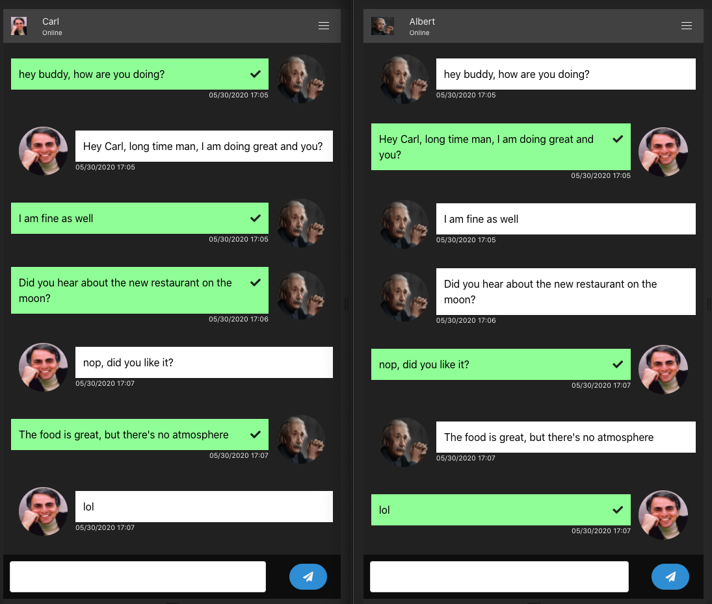
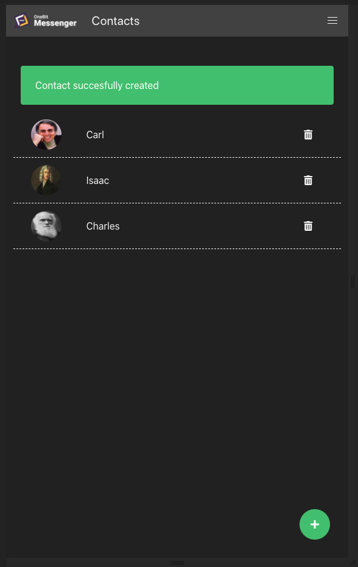

# One Bit Messenger
Send and receive messages using this awesome app.

As an `User` you can:
```
-> add new contacts;
-> check your contacts status (online or offline);
-> send and receive messages instantaneously;
-> an white check symbol is be showed when your message was sent, and a black check symbol if the reciever reads it.
```
- - - - -
# App Preview
`Conversation Sample`

  

- - - - -

`List Contacts`

  

## Ruby Verion
Ruby 2.7.0

## Rails Version
Rails 6.0.3

## Setup
Run in your console:
```
bin/setup
```
Delete the file `credentials.yml.enc` and run `EDITOR=vim rails credentials:edit`
It will generate a new `credentials.yml.enc` file and a new `master.key`.

Add the following value under development session:
```
development:
    redis_url: redis://localhost:6379/1
```
And then
```
rails db:prepare
```

## Project Inspiration
https://onebitcode.com/

Instructor:
Github: https://github.com/dfmoreto
Linkedin: https://www.linkedin.com/in/dfmoreto/
